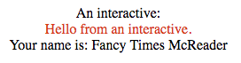

# Dynamic Interactive Component

An example of how a React component can be dynamically created from a stringified
Function (e.g., from a database).

The string is evaled into a factory function that is given `createReactClass`,
`createElement`, and `css` from `emotion`. A React component is returned and
rendered.

Here's how it looks:

